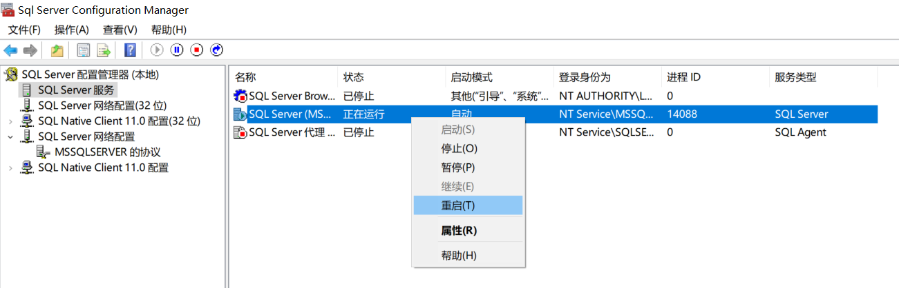

<center><font face="Time News Roman" size="18">DBMS</font><font face="黑体" size="20">的安装和使用</font>


<center>
    <font face="楷体" size="5">姓名：欧翌昕</font>
</center>

<center>
    <font face="楷体" size="5">专业：软件工程</font>
</center>

<center>
    <font face="楷体" size="5">学号：3190104783</font>
</center>

<center>
    <font face="楷体" size="5">课程名称：数据库系统</font>
</center>

<center>
    <font face="楷体" size="5">指导老师：高云君</font>
</center>


<center>
    </font><font face="黑体" size="5">2020~2021春夏学期 2021 年 3 月 21 日</font>
</center>

---

## 1 实验目的

1. 通过安装某个数据库管理系统，初步了解 DBMS 的运行环境
2. 了解 DBMS 交互界面、图形界面和系统管理工具的使用
3. 搭建实验平台

## 2 实验平台

|  操作系统  |      数据库管理系统       |
| :--------: | :-----------------------: |
| Windows 10 | SQL Server 2019 Developer |

## 3 实验内容和要求

1. 根据某个DBMS 的安装说明等文档，安装DBMS
2. 了解DBMS 的用户管理
3. 熟悉交互界面的基本交互命令
4. 熟悉图形界面的功能和操作
5. 了解基本的DBMS 管理功能和操作
6. 熟悉在线帮助系统的使用
7. 完成实验报告

## 4 实验步骤

### 4.1 下载安装Microsoft SQL Server

选择安装类型为“基本”


接受Microsoft SQL Server许可条款


浏览并选择合适的安装位置，点击“安装”


开始下载安装程序包


下载成功，开始安装


安装成功


继续下载SQL Server Management Studio (SSMS)，浏览并选择合适的安装位置，点击“安装”


开始安装，等待安装完成


安装成功


### 4.2 更改账户密码

打开SQL Server 2019 配置管理器，点击SQL Server网络配置->MSSQLSERVER 的协议->启用TCP/IP协议


打开SSMS，默认直接点击连接


连接成功后如下图


单击右键，点击属性打开设置


点击安全性，并选择SQL Server 和 Windows身份验证模式


点击连接，选择允许远程连接到此服务器，并点击“确定”


打开SQL Server 2019 配置管理器，点击SQL Servel服务，右键点击SQL Server选择重启



在安全性中点击系统默认的登录名sa开始设置


根据需要修改登录名以及默认密码


在状态中将该用户名启用，并点击“确定”


关闭所有窗口，重新进行连接时已经可以使用之前设置的用户名以及密码


### 4.3 创建表

打开SSMS，右键点击数据库选择新建数据库


设置数据库名称以及所有者，点击“确定”


点击刚创建的数据库并右键点击表选择新建表


根据需要插入列，设置列名、数据类型和是否允许Null值并保存


设置表名称，并点击“确定”


新建表成功


### 4.4 执行语句 select * from [table]; select * from [user].[table]

新建数据库的命令行窗口并输入以下SQL语句查询表的全部内容：

```sql
select * from students;
```


或输入以下SQL语句得到相同结果

```sql
select * from dbo.students;
```

