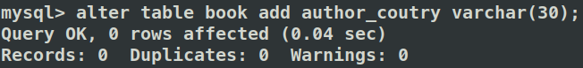
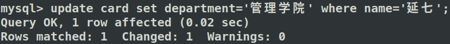

<center><font face="Time News Roman" size="18">SQL</font><font face="黑体" size="20">数据定义和操作</font>


<center>
    <font face="楷体" size="5">姓名：欧翌昕</font>
</center>

<center>
    <font face="楷体" size="5">专业：软件工程</font>
</center>

<center>
    <font face="楷体" size="5">学号：3190104783</font>
</center>

<center>
    <font face="楷体" size="5">课程名称：数据库系统</font>
</center>

<center>
    <font face="楷体" size="5">指导老师：高云君</font>
</center>


<center>
    </font><font face="黑体" size="5">2020~2021春夏学期 2021 年 3 月 21 日</font>
</center>

---

## 1 实验目的

1. 掌握关系数据库语言 SQL 的使用
2. 使所有的 SQL 作业都能上机通过

## 2 实验平台

|         操作系统          | 数据库管理系统 |
| :-----------------------: | :------------: |
| Ubuntu 20.04.2 LTS x86_64 |     MySQL      |


## 3 实验内容和要求

1. 建立数据库
2. 数据定义： 表的建立/删除/修改；索引的建立/删除；视图的建立/删除
3. 数据更新： 用 insert/delete/update 命令插入/删除/修改表数据
4. 数据查询： 单表查询，多表查询， 嵌套子查询等
5. 视图操作：通过视图的数据查询和数据修改
6. 所有的 SQL 作业都上机通过
7. 完成实验报告

## 4 实验步骤

### 4.1 建立数据库

以 `library` 为名建立数据库，使用的 SQL 语句如下：

```sql
create database library;
```


查看所有数据库，观察到 `library` 数据库已经成功建立。使用的 SQL 语句如下：

```sql
show databases;
```


选择 `library` 数据库，并查看所有表，观察到 `library` 数据库为空。使用的 SQL 语句如下：

```sql
use library;
show tables;
```


### 4.2 数据定义

#### 4.2.1 表的建立/删除/修改

以 `book` 为名建立书的表，属性包括书号、 类别,、书名、出版社、出版年份、作者、价格、总藏书量、目前库存量，使用的 SQL 语句如下：

```sql
create table book(
	bno char(8) primary key,
	category char(10),
	title varchar(40),
	press varchar(30),
	year int,
	author varchar(20),
	price decimal(7,2),
	total int,
	stock int
)DEFAULT CHARACTER SET utf8 COLLATE utf8_general_ci;
```


以 `borrow` 为名建立结借书记录的表，属性包括卡号、借书证号、结束日期和还书日期，使用的 SQL 语句如下：

```sql
create table borrow(
	cno char(7),
	bno char(8),
	borrow_date date,
	return_date date
)DEFAULT CHARACTER SET utf8 COLLATE utf8_general_ci;
```


查看已经建立的所有表，使用的 SQL 语句如下：

```sql
show tables;
```


观察到此处误将表名设置为 `card`，故需要修改表名，并重新查看已经建立的所有表，使用的 SQL 语句如下：

```sql
rename table card to borrow;
show tables;
```


以 `card` 为名建立借书证的表，属性包括卡号、姓名、单位、持证人类别，使用的 SQL 语句如下：

```sql
create table card(
	cno char(7) primary key,
	name varchar(10),
	department varchar(40),type char(1)
)DEFAULT CHARACTER SET utf8 COLLATE utf8_general_ci;
```


给 `book` 表添加属性作者国别，使用的 SQL 语句如下：

```sql
alter table book add author_coutry varchar(30);
```



查看 `book` 表结构，观察到属性已经添加成功。使用的 SQL 语句如下：

```sql
desc book;
```


删除 `book` 表新添加的字段，使用的 SQL 语句如下：

```sql
alter table book drop column author_coutry;
```


再次查看 `book` 表结构，观察到属性已经删除成功。


#### 4.2.2 索引的建立/删除

给 `book` 表的 `title` 字段建立一个索引，使用的 SQL 语句如下：

```sql
create index title_index on book(title);
```


删除刚建立的索引，使用的 SQL 语句如下：

```sql
alter table book drop index title_index;
```


#### 4.2.3 视图的建立/删除

以 `book` 表为基础建立视图 `book_view`，包括 `bno`, `category`, `title`, `press`, `year`, `author` 字段，使用的 SQL 语句如下：

```sql
create view book_view as
	select bno, category, title, press, year, author from book;
```


查看 `book_view` 视图结构，观察到视图建立成功。使用的 SQL 语句如下：

```sql
desc book_view;
```


### 4.3 数据更新

#### 4.3.1 插入表数据

分别向 `book` 表、`card` 表和 `borrow` 表中批量插入数据以供后续实验使用，使用的 SQL 语句如下：

```sql
insert into book values('bno1','计算机','SQL Server 2008 完全学习手册','清华出版社',2001,'郭郑州',79.80,5,3);
insert into book values('bno2','计算机','程序员的自我修养','电子工业出版社',2013,'俞甲子',65.00,5,5);
insert into book values('bno3','教育','做新教育的行者','福建教育出版社',2002,'高云鹏',25.00,3,2);
insert into book values('bno4','教育','做孩子眼中有本领的父母','电子工业出版社',2013,'高云鹏',23.00,5,5);
insert into book values('bno5','英语','实用英文写作','高等教育出版社',2008,'庞继贤',33.00,3,2);
```


```sql
insert into card values('cno1','张三','计算机学院','U');
insert into card values('cno2','李四','农学院','U');
insert into card values('cno3','王五','计算机学院','T');
insert into card values('cno4','朱六','计算机学院','G');
insert into card values('cno5','延七','经济学院','O');
insert into card values('cno6','凤姐','经济学院','O');
```


```sql
insert into borrow values('cno1','bno1','2010-6-4','2010-6-10');
insert into borrow values('cno1','bno2','2010-6-5','2010-6-10');
insert into borrow values('cno2','bno2','2010-7-4','2010-7-10');
insert into borrow values('cno3','bno3','2010-8-4','2010-8-10');
insert into borrow values('cno4','bno4','2010-9-4','2010-9-10');
```


#### 4.3.2 删除表数据

删除 `card` 表中姓名为“凤姐”的借书证记录，使用的 SQL 语句如下：

```sql
delete from card where name='凤姐';
```


查看 `card` 表中的内容，观察到删除表数据成功。使用的 SQL 语句如下：

```sql
select * from card;
```


#### 4.3.3 修改表数据

删除 `card` 表中姓名为“延七”的借书证记录的单位属性为“管理学院”，使用的 SQL 语句如下：

```sql
update card set department='管理学院' where name='延七';
```



查看 `card` 表中的内容，观察到修改表数据成功。


### 4.4 数据查询

#### 4.4.1 单表查询

查询当前库存在 5 本以下的书(书名、作者、出版社、年份、库存量)

，使用的 SQL语句如下：

```sql
select title,author,press,year,stock from book where stock<5;
```


#### 4.4.2 多表查询

查询张三同学借过的书的信息(列出书名、作者、出版社、借书时间)，使用的 SQL 语句如下：

```sql
select title,author,press,borrow_date from borrow natural join book natural join card
where name='张三';
```


#### 4.4.3 嵌套子查询

查询 `book` 表中价格最高的书的所有信息，使用的 SQL 语句如下：

```sql
select * from book where price >= (
	select max(price) from book
);
```


查询藏书量大于 1 的出版社的名称和藏书数，使用的 SQL 语句如下：

```sql
select press,sum(total) from book group by press
having sum(total)>1;
```


查询所有未借过书的借书证卡号，使用的 SQL 语句如下：

```sql
select cno from card where cno not in (
	select cno from borrow
);
```


### 4.5 视图操作

通过 `book_view`视图查询所有的书籍的信息，使用的 SQL 语句如下：

```sql
select * from book_view;
```


通过 `book_view`视图修改 《实用英文写作'》的年份为2010年，使用的 SQL 语句如下：

```sql
update book_view set year='2010' where title='实用英文写作';
```


通过 `book_view`视图查看所有书籍信息，以及 `book` 表中的所有书籍信息，观察到数据均被修改成功。

