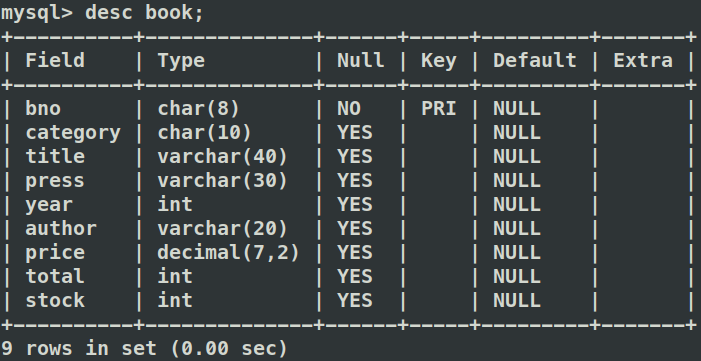

<center><font face="Time News Roman" size="18">SQL</font><font face="黑体" size="20">数据完整性</font>


<center>
    <font face="楷体" size="5">姓名：欧翌昕</font>
</center>

<center>
    <font face="楷体" size="5">专业：软件工程</font>
</center>

<center>
    <font face="楷体" size="5">学号：3190104783</font>
</center>

<center>
    <font face="楷体" size="5">课程名称：数据库系统</font>
</center>

<center>
    <font face="楷体" size="5">指导老师：高云君</font>
</center>


<center>
    </font><font face="黑体" size="5">2020~2021春夏学期 2021 年 4 月 23 日</font>
</center>


---

## 1 实验目的

1. 熟悉通过 SQL 进行数据完整性控制的方法

## 2 实验平台

|         操作系统          | 数据库管理系统 |
| :-----------------------: | :------------: |
| Ubuntu 20.04.2 LTS x86_64 |     MySQL      |


## 3 实验内容和要求

1. 定义若干表,其中包括 primary key, foreign key 和 check 的定义
2. 让表中插入数据,考察 primary key 如何控制实体完整性
3. 删除被引用表中的行,考察 foreign key 中 on delete 子句如何控制参照完整性
4. 修改被引用表中的行的 primary key,考察 foreign key 中 on update 子句如何控制参照完整性
5. 修改或插入表中数据,考察 check 子句如何控制校验完整性
6. 定义一个 assertion, 并通过修改表中数据考察断言如何控制数据完整性
7. 定义一个 trigger, 并通过修改表中数据考察触发器如何起作用

## 4 实验步骤

以 `library` 为名建立数据库。


选择 `library` 数据库，并查看所有表，观察到 `library` 数据库为空。


以 `book` 为名建立书的表，属性包括书号、 类别、书名、出版社、出版年份、作者、价格、总藏书量、目前库存量，使用的 SQL 语句如下：

```sql
create table book(
	bno char(8) primary key,
	category char(10),
	title varchar(40),
	press varchar(30),
	year int,
	author varchar(20),
	price decimal(7,2),
	total int,
	stock int
)DEFAULT CHARACTER SET utf8 COLLATE utf8_general_ci;
```


以 `card` 为名建立借书证的表，属性包括卡号、姓名、单位、持证人类别，使用的 SQL 语句如下：

```sql
create table card(
	cno char(7),
	name varchar(10),
	department varchar(40),
	type char(1),
	primary key(cno),
	check(type in ('T','G','U','O'))
)DEFAULT CHARACTER SET utf8 COLLATE utf8_general_ci;
```


以 `borrow` 为名建立结借书记录的表，属性包括卡号、借书证号、结束日期和还书日期，使用的 SQL 语句如下：

```sql
create table borrow(
	cno char(7),
	bno char(8),
	borrow_date datetime,
	return_date datetime,
	foreign key (bno) references book(bno) on delete cascade,
	foreign key (cno) references card(cno) on update cascade
)DEFAULT CHARACTER SET utf8 COLLATE utf8_general_ci;
```


查看表的结构以验证建立表的正确性。




分别向 `book` 表、`card` 表和 `borrow` 表中批量插入数据以供后续实验使用，使用的 SQL 语句如下：

```sql
insert into book values('bno1','计算机','SQL Server 2008 完全学习手册','清华出版社',2001,'郭郑州',79.80,5,3);
insert into book values('bno2','计算机','程序员的自我修养','电子工业出版社',2013,'俞甲子',65.00,5,5);
insert into book values('bno3','教育','做新教育的行者','福建教育出版社',2002,'高云鹏',25.00,3,2);
insert into book values('bno4','教育','做孩子眼中有本领的父母','电子工业出版社',2013,'高云鹏',23.00,5,5);
insert into book values('bno5','英语','实用英文写作','高等教育出版社',2008,'庞继贤',33.00,3,2);
```


```sql
insert into card values('cno1','张三','计算机学院','U');
insert into card values('cno2','李四','农学院','U');
insert into card values('cno3','王五','计算机学院','T');
insert into card values('cno4','朱六','计算机学院','G');
insert into card values('cno5','延七','经济学院','O');
insert into card values('cno6','凤姐','经济学院','O');
```


```sql
insert into borrow values('cno1','bno1','2010-6-4','2010-6-10');
insert into borrow values('cno1','bno2','2010-6-5','2010-6-10');
insert into borrow values('cno2','bno2','2010-7-4','2010-7-10');
insert into borrow values('cno3','bno3','2010-8-4','2010-8-10');
insert into borrow values('cno4','bno4','2010-9-4','2010-9-10');
```


查看表的内容以验证拆插入数据的正确性。


向 `book` 表中插入一条 `bno` 重复的记录，使用的 SQL 语句如下：

```sql
insert into book values('bno1','数学','概率论与数理统计','浙江大学出版社',2001,'吴国桢',29.50,6,5);
```


观察到 MySQL 给出报错信息，因为 `bno` 作为 `book` 表的主键，而主键是不允许重复的，故插入数据失败。

向 `card` 表中插入一条 `type` 字段为`X` 的记录，使用的 SQL 语句如下：

```sql
insert into card values('cno7','安东','控制学院','X');
```


观察到 MySQL 给出报错信息，因为在建立 `card` 表时设置了约束限制		`type` 字段的值为 `T`, `G`, `U`, `O` 之一，故插入数据失败。

删除 `card` 表中的所有记录，使用的 SQL 语句如下：

```sql
delete from card;
```


观察到 MySQL 给出报错信息，因为在建立 `borrow` 表时设置了外键约束，`on update` 子句控制了参照完整性，而在删除数据时没有定义行为，故删除数据失败。

修改 `book` 表中《程序员的自我修养》的书号，使用的 SQL 语句如下：

```sql
update book set bno='bno6' where title='程序员的自我修养';
```


观察到 MySQL 给出报错信息，因为在建立 `borrow` 表时设置了外键约束，`on delete` 子句控制了参照完整性，而在修改数据时没有定义行为，故修改数据失败。

经查阅相关资料发现 MySQL 不支持 assertion 断言，故无法进行相关实验。

定义一个触发器，作用是一张借书证不能同时借三本书。一般情况下，MySQL 默认是以 `;` 作为结束执行语句，与触发器中需要的分行起冲突。为解决此问题，可使用 `delimiter`将结束符号临时改变。当触发器创建完成后再次使用 `delimiter`将结束符号变为 `;`。使用的 SQL 语句如下：

```sql
delimiter ||
create trigger test before insert on borrow for each row
begin
	declare num int;
	declare msg varchar(60);
	set num = (select count(cno) from borrow where cno=NEW.cno);
	if num>=2 then
		select '一张借书证不能同时借三本书!' into @msg;
	end if;
end ||
delimiter ;
```


查看此时 `@msg` 的值。


观察到值为空。

向 `borrow` 表中继续插入数据，使用的 SQL 语句如下：

```sql
insert into borrow values('cno1','bno3','2010-6-5','2010-6-10');
```

再次查看此时 `@msg` 的值。


观察到值发生变化，说明触发器已经起作用，因为 `borrow` 表中原先已经有两条卡号为 `cno1` 的借书记录，再插入一条卡号为 `cno1` 的借书记录便会导致触发器生效。