<center><font face="Time News Roman" size="18">SQL</font><font face="黑体" size="20">安全性</font>


<center>
    <font face="楷体" size="5">姓名：欧翌昕</font>
</center>

<center>
    <font face="楷体" size="5">专业：软件工程</font>
</center>

<center>
    <font face="楷体" size="5">学号：3190104783</font>
</center>

<center>
    <font face="楷体" size="5">课程名称：数据库系统</font>
</center>

<center>
    <font face="楷体" size="5">指导老师：高云君</font>
</center>


<center>
    </font><font face="黑体" size="5">2020~2021春夏学期 2021 年 5 月 2 日</font>
</center>


## 1 实验目的

1. 熟悉通过 SQL 进行数据安全性控制的方法
2. 熟悉数据库中登录、用户、角色的概念和作用

## 2 实验平台

|         操作系统          | 数据库管理系统 |
| :-----------------------: | :------------: |
| Ubuntu 20.04.2 LTS x86_64 |     MySQL      |

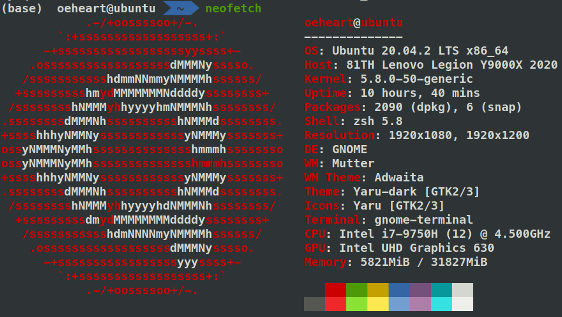

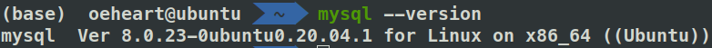

## 3 实验内容和要求

1. 建立表,考察表的生成者拥有该表的哪些权限
2. 使用SQL 的grant 和revoke命令对其他用户进行授权和权力回收,考察相应的作用
3. 建立视图,并把该视图的查询权限授予其他用户,考察通过视图进行权限控制的作用
4. 建立新的角色,并为其赋予权限(create table,view,procedure等),给用户添加角色
5. 完成实验报告

## 4 实验步骤

首先以 root 身份登陆 MySQL，创建一个普通用户。其中 ‘oeheart’ 是创建用户的用户名，‘localhost’ 指本地用户，‘oyx1234’ 是用户的登录密码。使用的 SQL 语句如下：

```sql
create user 'oeheart'@'localhost' identified by 'oyx1234';
```

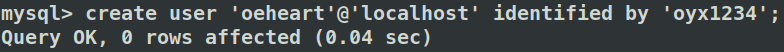

退出 root 身份，登陆用户 oeheart。

```shell
mysql -u oeheart -p
```

查看能否访问 `library` 数据库。使用的 SQL 语句如下：

```sql
show databases;
```

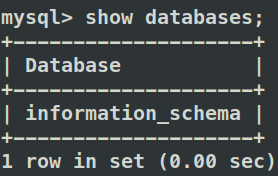

观察到 `library` 数据库根本无法显示。

尝试使用 `library` 数据库，使用的 SQL 语句如下：

```sql
use library;
```

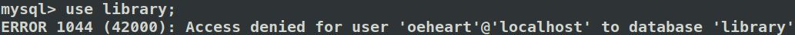

观察到 MySQL 给出报错信息，因为用户 oeheart 没有访问 `library` 数据库的权限，所以访问被拒绝。

重新以 root 身份登陆 MySQL，赋予用户 oeheart 访问 `library` 数据库并查询和插入的权限，使用的 SQL 语句如下：

```sql
grant select,insert on library.* to 'oeheart'@'localhost';
flush privileges;
```

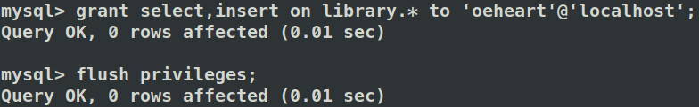

重新登陆用户 oeheart，再次查看能否访问 `library` 数据库。

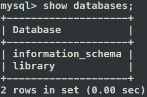

观察到 `library` 数据库显示正常。继续查看能否访问 `library` 数据库中的表，使用的 SQL 语句如下：

```sql
use library;
show tables;
```

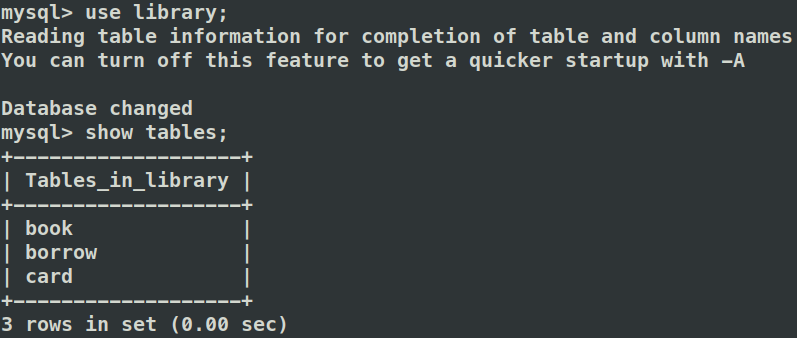

观察到 `book`表、`borrow` 表、`card` 表均显示正常。继续查看能否对 `library` 数据库中的表进行查询操作，使用的 SQL 语句如下：

```sql
select bno,category,title,author from book;
```

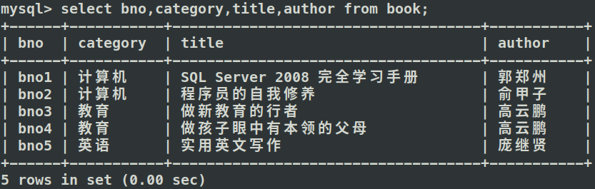

观察到查询成功。继续查看能否对 `library` 数据库中的表进行插入操作，使用的 SQL 语句如下：

```sql
insert into book values('bno6','数学','概率论与数理统计','浙江大学出版社','2012','吴国桢','25.80','15','7');
select bno,category,title,author from book;
```

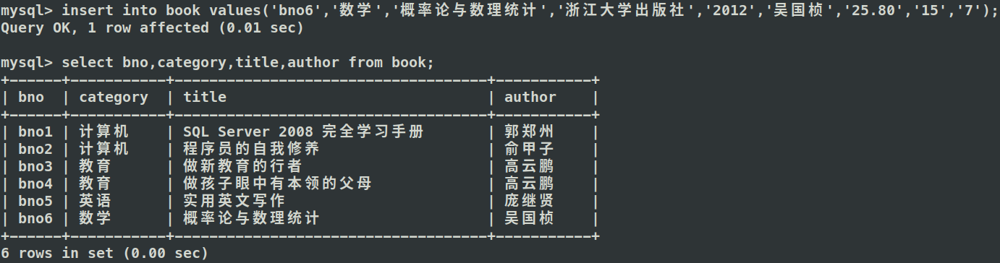

观察到插入成功。继续查看能否对 `library` 数据库中的表进行插入操作，使用的 SQL 语句如下：

```sql
delete from book 
where title='概率论与数理统计';
```

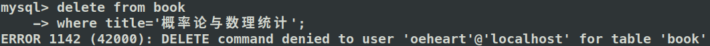

观察到 MySQL 给出报错信息，因为用户 oeheart 没有删除 `library` 数据库中的表中数据的权限，所以删除操作被拒绝。继续查看能否对 `library` 数据库中的表进行修改操作，使用的 SQL 语句如下：

```sql
update book set price='75.00' 
where title='概率论与数理统计';
```

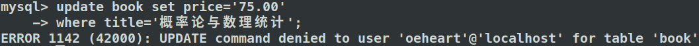

观察到 MySQL 给出报错信息，因为用户 oeheart 没有修改 `library` 数据库中的表中数据的权限，所以修改操作被拒绝。

重新以 root 身份登陆 MySQL，回收用户 oeheart 访问 `library` 数据库并查询和插入的权限，使用的 SQL 语句如下：

```sql
revoke select,insert on library.* from 'oeheart'@'localhost';
flush privileges;
```

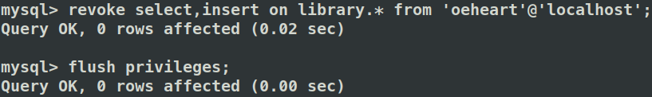

重新登陆用户 oeheart，再次查看能否访问 `library` 数据库。

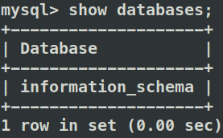

观察到 `library` 数据库已无法显示，因为用户 oeheart 访问 `library` 数据库的权限已被 root 用户回收。